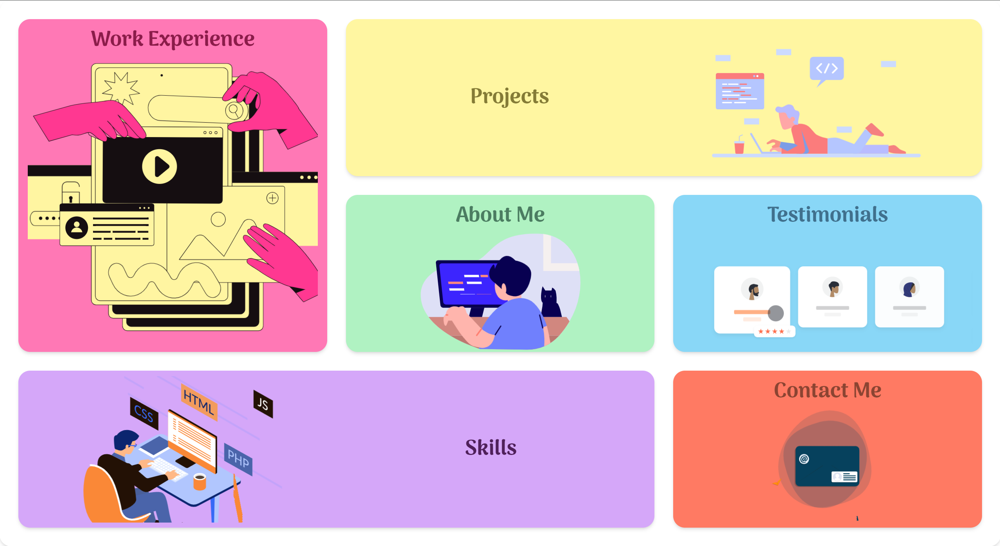

## Bento Portfolio

This is a bento grid styled animated portfolio with a beautiful UI. You can view the live version [here](https://varadverse.vercel.app/).



### Purpose

The purpose of this project is to provide a visually appealing and interactive portfolio template for developers and designers to showcase their work.

### Functionality

- Animated bento grid layout
- Responsive design
- Smooth transitions and animations
- Easy to customize

### Technologies Used

- **React**: For building the user interface
- **Vite**: For fast development and build tooling
- **Tailwind CSS**: For styling
- **LottieFiles**: For animations

### Setup Instructions

1. Clone the repository:
    ```sh
    git clone https://github.com/devVaradPatil/bento_portfolio.git
    ```
2. Navigate to the project directory:
    ```sh
    cd bento-portfolio
    ```
3. Install dependencies:
    ```sh
    npm install
    ```
4. Start the development server:
    ```sh
    npm run dev
    ```
5. Open your browser and go to `http://localhost:3000` to see the portfolio.

### Standout Features

- **Beautiful UI**: The portfolio features a clean and modern design that is visually appealing.
- **Animations**: Smooth animations from LottieFiles enhance the user experience.
- **Customization**: Easily customizable to fit your personal style and needs.
- **Responsive**: Works well on both desktop and mobile devices.
